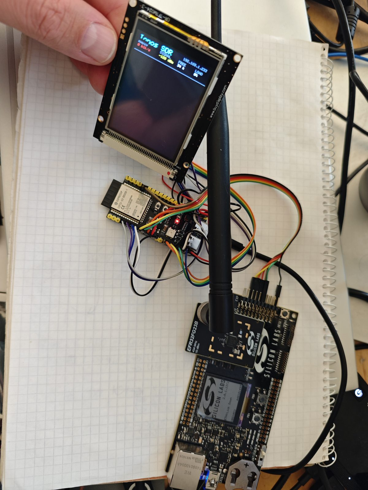
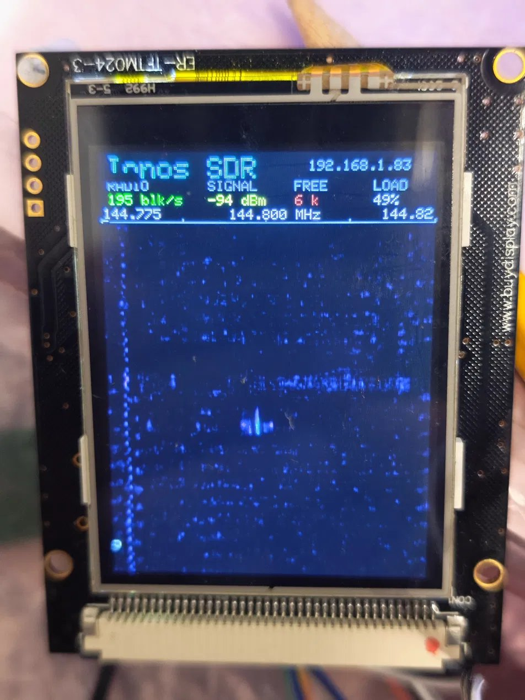
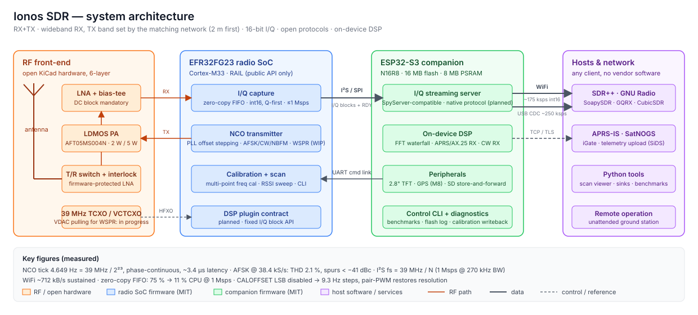

# Ionos SDR

Open, calibrated, remotely usable SDR transceiver on a commodity ISM radio SoC (Silicon Labs EFR32FG23) with an ESP32‑S3 companion. 16‑bit I/Q over WiFi/USB, open protocols, on‑device DSP. RX tunes across the SoC's range (optimum inside the matched band); TX is matching‑network dependent — the 2 m band first, further bands as plug‑in matching on the final hardware.

<p>


</p>

*Prototype (left): Silicon Labs WSTK + EFR32FG23 radio board, ESP32‑S3 module, 2.8" TFT. Right: waterfall at 144.800 MHz with an APRS burst.*

**Demo video:** [youtu.be/TvFiH6MmJB0](https://youtu.be/TvFiH6MmJB0) — [](https://youtu.be/TvFiH6MmJB0)

**Status: working prototype.** Everything marked *validated* has a measurement in [`measurements/`](measurements/).

## Architecture



- **RX**: FG23 I/Q capture → zero‑copy FIFO → ESP32‑S3 → host (SDR++, GNU Radio via SoapySDR, GQRX…).
- **TX**: no I/Q DAC on the FG23; modulation is synthesised by stepping the PLL frequency offset (NCO). Constant‑envelope modes only on‑chip.
- **Reference**: 39 MHz TCXO; VCTCXO with VDAC pulling for WSPR is in progress. Roadmap: TCXO + open‑loop ΣΔ for 2 m, thermal LUT + GPS trim for higher bands.

## Status

| Feature | State |
|---|---|
| I/Q streaming to SDR++ over WiFi (SpyServer protocol) | validated, ~712 kB/s sustained |
| I/Q over USB CDC | ~250 ksps int16 |
| APRS AX.25/AFSK‑1200 TX (NCO) | validated on‑air, decoded on APRS‑IS |
| NBFM voice TX, CW TX (ramped envelope) | validated |
| WSPR encoder | bit‑exact vs. independent reference; on‑air WSPR TX (VCTCXO pulling) in progress |
| On‑device FFT waterfall, 2.8" TFT | working |
| Multi‑point frequency calibration | validated |
| GPS time + locator | working |
| Open KiCad hardware (6‑layer) | in progress — prototype runs on BRD4265B + custom carrier |
| Native streaming protocol spec, SoapySDR driver, DSP plugin API | planned |
| SatNOGS ground‑station client | planned |

## Measured facts you need before touching the code

| | |
|---|---|
| `RAIL_SetFreqOffset` tick | 4.649 Hz = 39 MHz / 2²³, phase‑continuous, ~3.4 µs call latency |
| AFSK synthesis | 38.4 kS/s → THD 2.1 %, spurs < −41 dBc |
| CALOFFSET register | LSB intentionally disabled → 9.3 Hz effective steps; pair‑PWM restores resolution |
| I/Q format | `int16` LE, **Q first** (`struct { int16_t q, i; }`), same as geckokapula |
| I²S sample rate | 39 MHz / N; 1000 ksps @ 270 kHz BW, 400 @ 100, 70 @ 50 |
| FIFO read | `RAIL_ReadRxFifo(rail, NULL, n)` (zero‑copy): 75 % → 11 % CPU at 1 Msps |
| Front‑end | DC block between bias‑tee and FG23 match is mandatory; firmware TX interlock protects the LNA |

## Repository

```
hardware/          KiCad, fab outputs, BOM                    CERN-OHL-P-2.0
firmware-fg23/     EFR32FG23: iq_capture, cw_trainer, railtest_wspr   MIT
firmware-esp32/    ESP32-S3 streaming/TFT/GPS/APRS-RX (PlatformIO)    MIT
host/              libionos (MIT), soapy (MIT), sdrpp-source (GPL-3.0)
measurements/      raw captures, scripts, results             CC-BY-4.0
docs/              protocol, calibration, CLI, guides         CC-BY-4.0
```

## Build

- **FG23**: Simplicity Studio 2025.6 / Simplicity SDK, RAIL 2.19, GCC. Import `firmware-fg23/iq_capture/*.slcp`, regenerate, copy `station_config.example.h → station_config.h`. Needs "RAIL Utility, Initialization" and `SL_BOARD_ENABLE_VCOM=1`.
- **ESP32‑S3**: PlatformIO, target N16R8. Copy `secrets.example.h → secrets.h` and `station_config.example.h → station_config.h` in `src/`. `CONFIG_SPIRAM_TRY_ALLOCATE_WIFI_LWIP=y` is required for the quoted WiFi throughput.
- **SDR++**: connect with the built‑in SpyServer source, or build `host/sdrpp-source/` (see its README).

## Credits, licensing, trademarks

Builds on [geckokapula](https://github.com/tejeez/geckokapula) by OH2EAT (MIT). Silicon Labs RAIL is used through its public API only; PHY findings are clean‑room. Licences per directory (see above). Not affiliated with IONOS SE or Silicon Laboratories; EFR32 and Simplicity Studio are Silicon Labs trademarks.

Zoltan Doczi, HA7DCD — Budapest. RTL‑SDR Blog V3 co‑designer, KrakenSDR co‑creator, TAPR QRPi designer.
