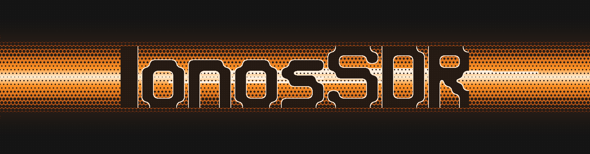

<p align="center"></p>

# Ionos SDR

Open, calibrated, remotely usable SDR transceiver on a commodity ISM radio SoC (Silicon Labs EFR32FG23) with an ESP32‑S3 companion. 16‑bit I/Q over WiFi/USB, open protocols, on‑device DSP. RX tunes across the SoC's range (optimum inside the matched band); TX is matching‑network dependent — the 2 m band first, further bands as plug‑in matching on the final hardware.

<p align="center">


</p>

<p align="center"><i>Prototype (left): Silicon Labs WSTK + EFR32FG23 radio board, ESP32‑S3 module, 2.8" TFT. Right: waterfall at 144.800 MHz with an APRS burst.</i></p>

<p align="center"><b>Demo videos</b></p>
<p align="center">
<a href="https://youtu.be/TvFiH6MmJB0"></a>
&nbsp;&nbsp;
<a href="https://youtu.be/0PxuDpmvdRM"></a>
</p>
<p align="center"><i>Left: <a href="https://youtu.be/TvFiH6MmJB0">bench test</a> — streaming, waterfall, APRS. Right: <a href="https://youtu.be/0PxuDpmvdRM">spectrum painting</a> — HackRF as the painting signal generator, Ionos SDR as the receiver. (Hungarian narration.)</i></p>

**Status: working prototype.** Everything marked *validated* has a measurement in [`measurements/`](measurements/).

## Architecture

<p align="center"></p>

- **RX**: two modes on the same hardware, switchable from the host (see below).
- **TX**: no I/Q DAC on the FG23; modulation is synthesised by stepping the PLL frequency offset (NCO). Constant‑envelope modes only on‑chip.
- **Reference**: 39 MHz TCXO; VCTCXO with VDAC pulling for WSPR is in progress. Roadmap: TCXO + open‑loop ΣΔ for 2 m, thermal LUT + GPS trim for higher bands.

## Two receive modes

| | Narrowband I/Q stream | Wideband RSSI fast scan |
|---|---|---|
| What | Classic SDR: 16‑bit I/Q samples from the FG23 capture path, streamed to the host | Panadapter: the FG23 hops across a channel grid, measures RSSI per bin (`RAIL_GetRssiAlt`), and sends one spectrum line per sweep |
| Bandwidth | ≤ 270 kHz I/Q window (≤ 1 Msps on‑chip); ~175 ksps sustained over WiFi, ~250 ksps over USB CDC | Up to 10 MHz span in one sweep (e.g. 144.8–154.8 MHz on the 25 kHz / 401‑channel grid; 320–2048 bins, 31.25 kHz step at 320) |
| Rate | continuous | ~5–7 lines/s (settle 200 µs + RSSI wait 400 µs per bin, tunable) |
| Host | any SpyServer client (SDR++, SDR#…), later SoapySDR/GNU Radio | SDR++ via the `fg23` source module in SCAN mode (spectrum/waterfall only, no audio), TFT/OLED on the device |
| Use | demodulation, recording, DSP work, weak‑signal modes | finding activity across a band, then zoom in with the I/Q mode |

The I/Q stream is the mode that has had the most measurement time: block‑boundary sample loss, the periodic WiFi stall and the SPI/WiFi glitch correlation were each traced and fixed, and the stream now runs glitch‑free over WiFi at the quoted rates (see `measurements/`). The scan mode reuses the same SPI/LDMA transport in an "ext" mode (1040‑byte `SPECLINE` blocks, `specline.h` shared by both firmwares) and stops/restarts the I/Q stream around a sweep.

## Status

| Feature | State |
|---|---|
| Narrowband 16‑bit I/Q streaming over WiFi (SpyServer protocol) | validated, ~712 kB/s sustained, glitch‑free |
| I/Q over USB CDC | ~250 ksps int16 |
| APRS AX.25/AFSK‑1200 TX (NCO) | validated on‑air, decoded on APRS‑IS |
| NBFM voice TX, CW TX (ramped envelope) | validated |
| WSPR encoder | bit‑exact vs. independent reference; on‑air WSPR TX (VCTCXO pulling) in progress |
| Wideband RSSI fast scan → SDR++ (fg23 source module) | working, ~5–7 lines/s at 10 MHz span |
| On‑device FFT waterfall, 2.8" TFT | working |
| Multi‑point frequency calibration | validated |
| GPS time + locator | working |
| Open KiCad hardware (6‑layer) | in progress — prototype runs on BRD4265B + custom carrier |
| Native streaming protocol spec, SoapySDR driver, DSP plugin API | planned |
| SatNOGS ground‑station client | planned |

## Measured facts you need before touching the code

| | |
|---|---|
| `RAIL_SetFreqOffset` tick | 4.649 Hz = 39 MHz / 2²³, phase‑continuous, ~3.4 µs call latency |
| AFSK synthesis | 38.4 kS/s → THD 2.1 %, spurs < −41 dBc |
| CALOFFSET register | LSB intentionally disabled → 9.3 Hz effective steps; pair‑PWM restores resolution |
| I/Q format | `int16` LE, **Q first** (`struct { int16_t q, i; }`), same as geckokapula |
| I²S sample rate | 39 MHz / N; 1000 ksps @ 270 kHz BW, 400 @ 100, 70 @ 50 |
| FIFO read | `RAIL_ReadRxFifo(rail, NULL, n)` (zero‑copy): 75 % → 11 % CPU at 1 Msps |
| Front‑end | DC block between bias‑tee and FG23 match is mandatory; firmware TX interlock protects the LNA |

## Repository

```
hardware/          KiCad, fab outputs, BOM                    CERN-OHL-P-2.0
firmware-fg23/     EFR32FG23: iq_capture, cw_trainer, railtest_wspr   MIT
firmware-esp32/    ESP32-S3 streaming/TFT/GPS/APRS-RX (PlatformIO)    MIT
host/              libionos (MIT), soapy (MIT), sdrpp-source (GPL-3.0)
measurements/      raw captures, scripts, results             CC-BY-4.0
docs/              protocol, calibration, CLI, guides         CC-BY-4.0
```

## Build

- **FG23**: Simplicity Studio 2025.6 / Simplicity SDK, RAIL 2.19, GCC. Import `firmware-fg23/iq_capture/*.slcp`, regenerate, copy `station_config.example.h → station_config.h`. Needs "RAIL Utility, Initialization" and `SL_BOARD_ENABLE_VCOM=1`.
- **ESP32‑S3**: PlatformIO, target N16R8. Copy `secrets.example.h → secrets.h` and `station_config.example.h → station_config.h` in `src/`. `CONFIG_SPIRAM_TRY_ALLOCATE_WIFI_LWIP=y` is required for the quoted WiFi throughput.
- **SDR++**: connect with the built‑in SpyServer source, or build `host/sdrpp-source/` (see its README).

## Credits, licensing, trademarks

Builds on [geckokapula](https://github.com/tejeez/geckokapula) by OH2EAT (MIT) for the capture core; the SDR++ module is based on Ryzerth's SpyServer source (GPL‑3.0); the AFSK/HDLC design follows LibAPRS/BertOS; WSPR is K1JT's protocol; the CW trainer concept is N7HPR's. Full list with licences in [ACKNOWLEDGEMENTS.md](ACKNOWLEDGEMENTS.md). Silicon Labs RAIL is used through its public API only; PHY findings are clean‑room. Licences per directory (see above). Not affiliated with IONOS SE or Silicon Laboratories; EFR32 and Simplicity Studio are Silicon Labs trademarks.

Zoltan Doczi, HA7DCD — Budapest. RTL‑SDR Blog V3 co‑designer, KrakenSDR co‑creator, TAPR QRPi designer. Special thanks to [Z2Labs](https://www.z2labs.io) for their help, ideas and shared thinking throughout the project.
